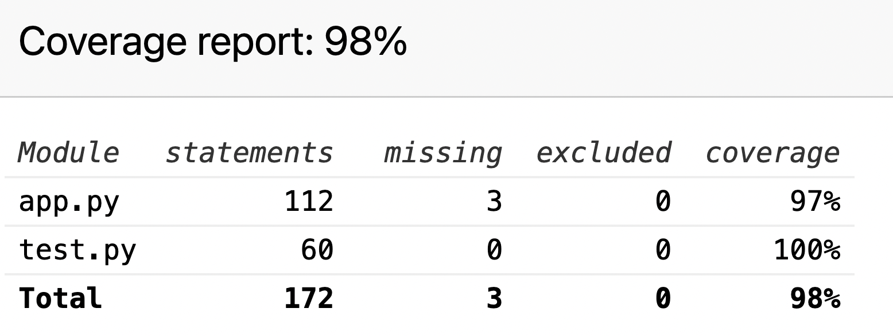

# README

> CITS3403 Online Daily Puzzle Project.

## Project design

### A `Four-leaf clover` word puzzle online game

### The rules of the game

Given four letters at each time, players were asked to guess the  word consists of the four letters, and those who could spell more words in a minute did better.

## Front-end
1. The front-end uses the following technologies:
- `HTML5 & CSS3 & JavaScript`
- `Bootstrap`
- `jQuery`
2. Pages:
- User sign up page
- User login page
- Game page
- Help page
- Statistics page with a share button
3. The game work on `Chrome`, `Firefox` and `Microsoft Edge`, and render well on mobile devices.
4. All the HTML and CSS files passed this W3C Validation.

## Backend
1. Backend use `Python` with `FLASK` web framework.
2. Backend functions:
- Use `SQLite` database to save information of `words` / `user` / `Game`.
- User registration information is stored in the database table `user`.
- About 400 friendly English words are stored in the database table `word`, and the system automatically randomly selects one word at a time, and sends it out of order to the front end for players to use vie AJAX / JSON. 
- The game result data of each player is stored in the associative table `game`, which stores the game result including the user ID, the number of words selected by the user this time, the content of each word, and the end time of the game

## Test
1. Use `unittest` test `app.py` method
2. Test guide
> In CMD or Terminal
- `coverage html -d testreport`
- Open test report in 'testreport/index.html'

## QUICK START
> In CMD or Terminal
- `pip install -r requirements.txt`
- `python app.py
- `
- Open [http://127.0.0.1:5000](http://127.0.0.1:5000)
